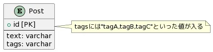

# 以下の画像の設計で起きる問題



1. クエリを発行する際に、パターンマッチや区切り表現で分解する処理が必要となる
   1. (例)  ```SELECT text FROM POST WHERE tags REGEXP ('(^|,)', 2, '(,|$)');```
2. 不正な値を挿入してしまう可能性がある

>カラムの型（varchar）は今の段階では特に気にしないで結構です。
問題文にこのように記載があったため、あえて、データ型については言及にしていないが、tagが増えるたびに、カラムに入らなくなる
