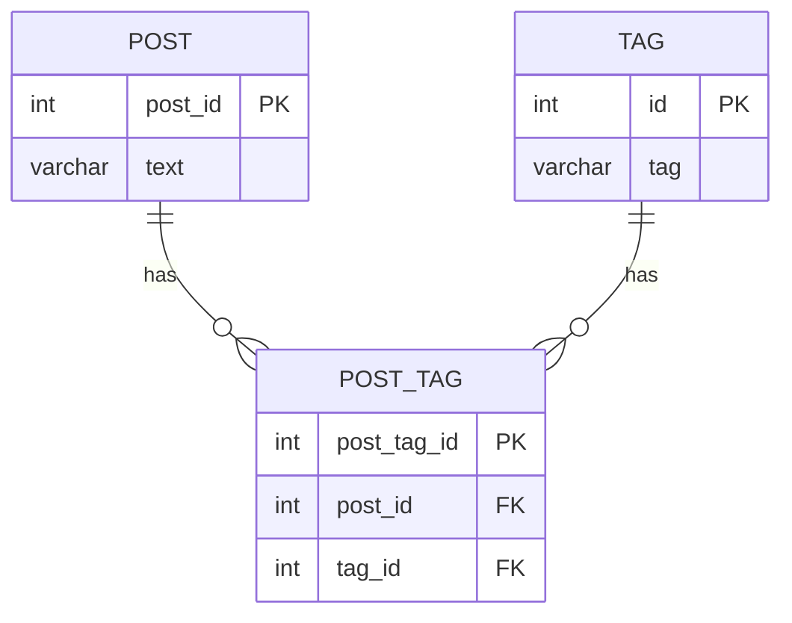

### 課題1で出た問題点を受けてのDB設計の変更

1. 多対多に変更して、中間テーブルをおく

```mermaid
erDiagram
  POST {
    int post_id PK
    varchar text
  }

  POST_TAG {
    int post_tag_id PK
    int post_id FK
    int tag_id FK
  }

  TAG {
    int id PK
    varchar tag
  }

  POST ||--o{ POST_TAG : "has"
  TAG ||--o{ POST_TAG : "has"
```

中間テーブルを用意することで、postに対して、tagが増えても第一正規化を保つことができる
