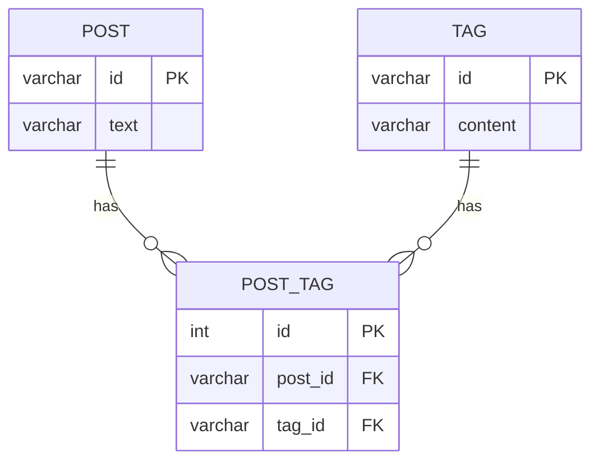

### 課題1の問題は解決できるでしょうか？

【回答】
多対多に変更して、中間テーブルをおく

```mermaid
erDiagram
  POST {
    varchar id PK
    varchar text
  }

  TAG {
    varchar id PK
    varchar content
  }

  POST_TAG {
    int id PK
    varchar post_id FK
    varchar tag_id FK
  }

  POST ||--o{ POST_TAG : "has"
  TAG ||--o{ POST_TAG : "has"
```

【変更した場合のメリット】
1. 正規化が保たれる
2. JOINをする必要があるが、クエリが複雑にならない
3. tagが増えても安心
