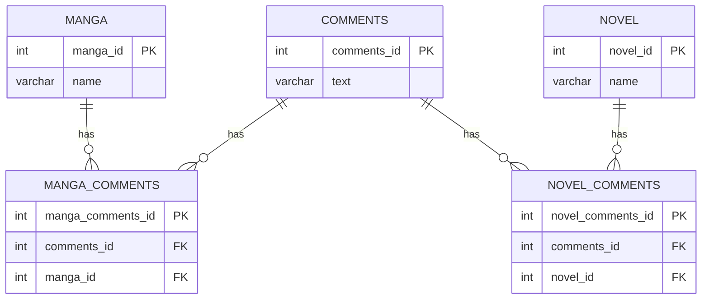
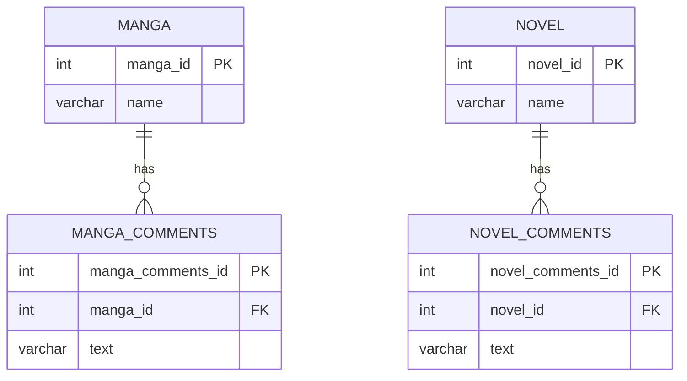

上記のように中間テーブル作成する。

メリット
1. 各テーブルがそれぞれの責務に専念でき、外部キー制約によって参照整合性が保証される。
2. 将来の変更に対応できる
   1. magazineテーブルなども容易に作成できる
3. SQLのJOINクエリがシンプルになり、メンテナンスもしやすくなる

### review指摘後の修正

今回の場合自分が考えたように中間テーブルを作成する必要があるのか再度検討してみた
今回の場合、「そもそも1つのcommentテーブルに保存しておく必要があるのか」とう視点が抜けていた。
なので、以下のようにcommentテーブルを分解する方針で行う。

