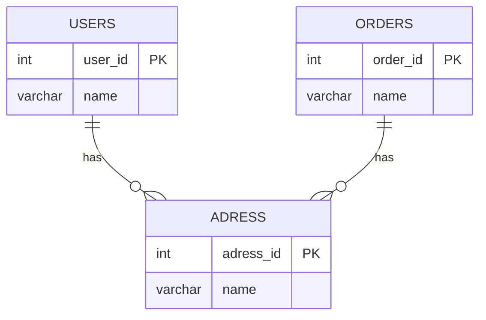

### どのようなケースで問題が起きそうか？

ECサイトのAddressとUsersとOrdersの関係

```mermaid
erDiagram
  USERS {
    int user_id PK
    varchar name
  }

  ADRESS {
    int adress_id PK
    varchar name
  }

  ORDERS {
    int order_id PK
    varchar name
  }

  USERS ||--o{ ADRESS : "has"
  ORDERS ||--o{ ADRESS : "has"
```

課題1のアンチパターンと同じようにポリモフィックなER図になっている
