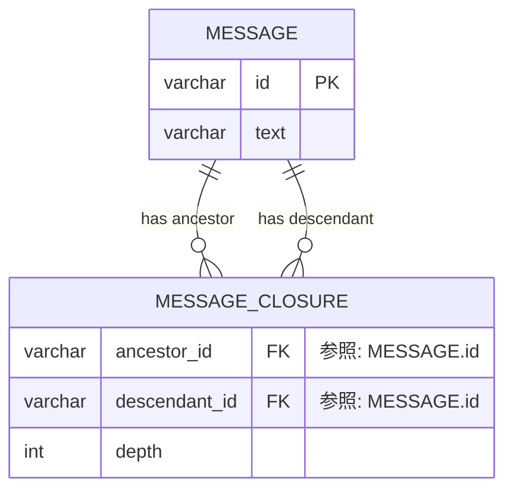

## 新しいスキーマ

様々な方法があるが今回は閉包テーブルを使った設計を行う

```mermaid
erDiagram
    MESSAGE {
      varchar id PK
      varchar text
    }

    MESSAGE_CLOSURE {
      varchar ancestor_id FK "参照: MESSAGE.id"
      varchar descendant_id FK "参照: MESSAGE.id"
      int depth
    }

    MESSAGE ||--o{ MESSAGE_CLOSURE : "has ancestor"
    MESSAGE ||--o{ MESSAGE_CLOSURE : "has descendant"
```

-	循環参照の防止
- 高速なツリー走査
  - 特定ノードの全祖先や全子孫を一度のクエリで取得でき、再帰的なCTEを使うよりも効率的にツリー全体を走査できます。
