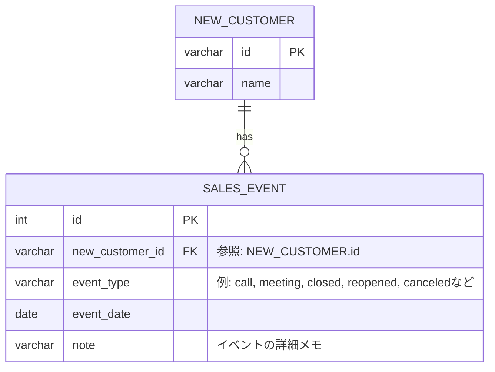
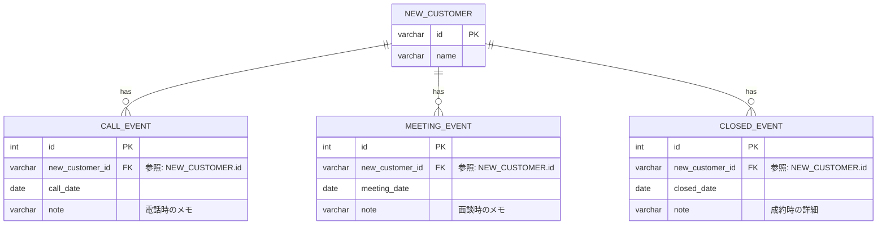

### 修正したDB設計

### 1. event_typeごとに変更を持たせるパターン

テーブルが2つになり、拡張されても正規化を保つことができている。
ただ、event_typeが複数の値を持つので、event_typeごとにテーブルを分割した方がいいと思ったので、案2として、以下に書いている。

###  2. event_typeごとにテーブルを作成するパターン

下記の構成の方が、例えば、「callのコールの履歴を取得したとき」なのに、効率的にクエリを作成できる。
ただ、その各種イベントを一気に取得する際にJOINが多数生じるのでトレードオフな気がする。

1と2については議論したいところです。
