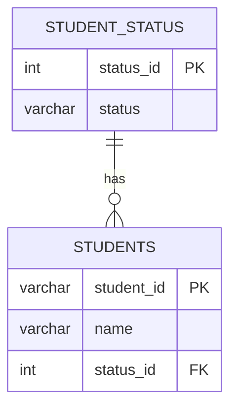

### どのようにテーブル設計を見直せば課題1の問題は解決できるでしょうか？

### 実装方針
ステータスの部分を新たなテーブルに切り出し、1対多にする
以下のようにすることで拡張性が向上する

```mermaid
erDiagram
    STUDENT_STATUS {
        int status_id PK
        varchar status
    }
    STUDENTS {
        varchar student_id PK
        varchar name
        int status_id FK
    }
    STUDENT_STATUS ||--o{ STUDENTS : "has"
```

### 参考文献
SQLアンチパターン 第10章
