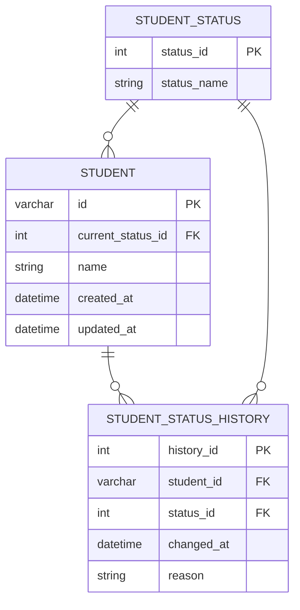

## 解決策

新たに以下のテーブルを作成する

- student_status
  - ステータス管理
- student_status_history
  - 過去のステータス履歴

最初はdelete_usersテーブルだけを作成していたが、上記のように変更した。

理由は、以下です。

- データ分析などで退会理由などが必要な場合がある
- 再入会したいなどにdelte_usersだけなら、元の生徒情報とその関連データが完全に切り離されていると、復元処理や過去データの参照が困難になる
