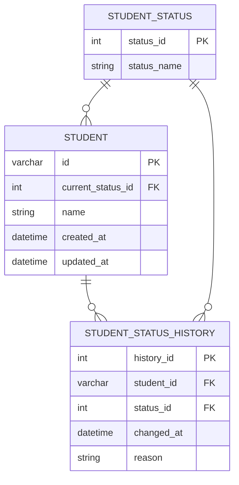

## 解決策

以下を参考にした
https://www.slideshare.net/slideshow/ronsakucasual/52256922#20

新たに以下のテーブルを作成する
- student_status
  - ステータス管理
- student_status_history
  - 過去のステータス履歴

```mermaid
erDiagram
    STUDENT {
      varchar id PK
      int current_status_id FK
      string name
      datetime created_at
      datetime updated_at
    }
    STUDENT_STATUS {
      int status_id PK
      string status_name
    }
    STUDENT_STATUS_HISTORY {
      int history_id PK
      varchar student_id FK
      int status_id FK
      datetime changed_at
      string reason
    }
    
    STUDENT_STATUS ||--o{ STUDENT : ""
    STUDENT ||--o{ STUDENT_STATUS_HISTORY : ""
    STUDENT_STATUS ||--o{ STUDENT_STATUS_HISTORY : ""
```
