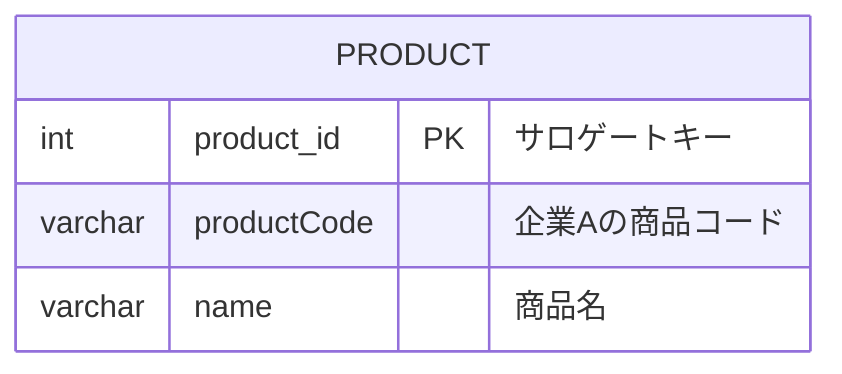

## どのような主キーを設定すれば、[課題1](https://www.notion.so/1-eda45db8b2864d268ab22a34fd61ce71?pvs=21)の問題は解決できるでしょうか？

## 考察

1. 前提として主キーは一意にする。UUIDやAUTO_INCREMENTなどを利用する
2. 今回の場合、productCodeを主キーにするのではなく新たにproduct_id(サロゲートキー)を作成する

## ER図

