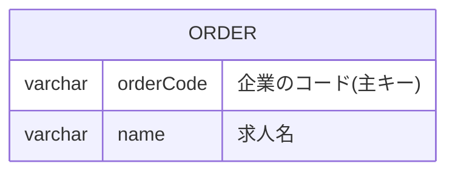

### どんなサービスを開発している時に課題1のようなアンチパターンに陥りそうでしょうか？

### 考察

今回は転職サイトを例にする。

- 求人の種類は2種類ある。
   1. 自社で獲得した求人
   2. 提携企業が掲載した求人

課題1のように、求人によって、企業のコードを
主キーとしておいてしまう場合がある。

```mermaid
erDiagram
    ORDER {
      varchar orderCode "企業のコード(主キー)"
      varchar name "求人名"
    }
```
