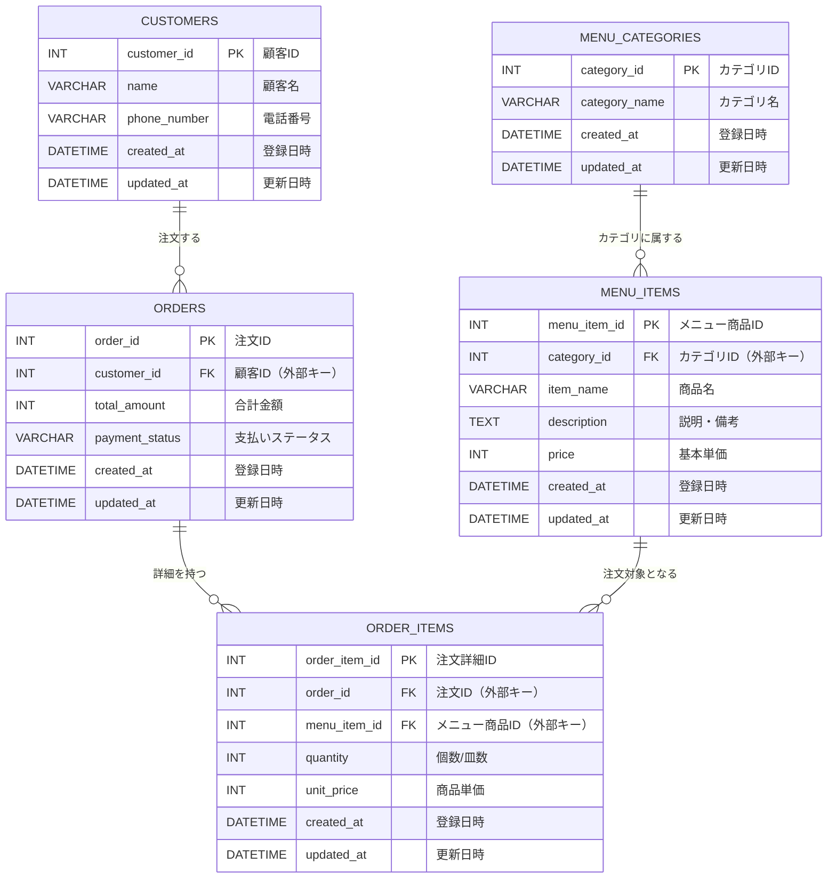

## テーブル設計

### 1. customers（顧客情報）テーブル

| フィールド         | 型             | 主キー(PK) | NOT NULL | 説明                               |
|--------------------|----------------|------------|----------|------------------------------------|
| customer_id        | INT            | PK         | YES      | 顧客を一意に識別するID             |
| name               | VARCHAR(100)   |            |          | 顧客名                             |
| phone_number       | VARCHAR(11)    |            |          | 電話番号                           |
| created_at         | DATETIME       |            | YES      | 登録日時                           |
| updated_at         | DATETIME       |            | YES      | 更新日時                           |

### 2. orders（注文ヘッダ）テーブル

| フィールド         | 型             | 主キー(PK) | NOT NULL | 説明                                    |
|--------------------|----------------|------------|----------|-----------------------------------------|
| order_id           | INT            | PK         | YES      | 注文を一意に識別するID                  |
| customer_id        | INT            |            | YES      | `customers.customer_id`へのFK           |
| total_amount       | INT            |            | YES      | 合計金額(税抜/税込どちらにするかは要検討)|
| payment_status     | VARCHAR        |            | YES      | 支払いステータス(enumにしたい)          |
| order_date         | DATETIME       |            | YES      | 注文日時                                |
| created_at         | DATETIME       |            | YES      | 登録日時                                |
| updated_at         | DATETIME       |            | YES      | 更新日時                                |

### 3. order_items（注文詳細）テーブル

| フィールド         | 型             | 主キー(PK) | NOT NULL | 説明                                       |
|--------------------|----------------|------------|----------|--------------------------------------------|
| order_item_id      | INT            | PK         | YES      | 注文詳細行を一意に識別するID               |
| order_id           | INT            |            | YES      | `orders.order_id`へのFK                    |
| menu_item_id       | INT            |            | YES      | `menu_items.menu_item_id`へのFK            |
| quantity           | INT            |            | YES      | 個数/皿数                                  |
| unit_price         | INT            |            | YES      | 商品単価                                   |
| created_at         | DATETIME       |            | YES      | 登録日時                                   |
| updated_at         | DATETIME       |            | YES      | 更新日時                                   |

### 4. menu_categories（メニューカテゴリ）テーブル

| フィールド         | 型             | 主キー(PK) | NOT NULL | 説明                                    |
|--------------------|----------------|------------|----------|-----------------------------------------|
| category_id        | INT            | PK         | YES      | カテゴリを一意に識別するID              |
| category_name      | VARCHAR(100)   |            | YES      | カテゴリ名(例: “盛り込み”, “お好みすし”)|
| created_at         | DATETIME       |            | YES      | 登録日時                                |
| updated_at         | DATETIME       |            | YES      | 更新日時                                |

### 5. menu_items（メニュー商品マスタ）テーブル

| フィールド         | 型             | 主キー(PK) | NOT NULL | 説明                                                |
|--------------------|----------------|------------|----------|-----------------------------------------------------|
| menu_item_id       | INT            | PK         | YES      | メニュー商品(単品/セット)を一意に識別するID         |
| category_id        | INT            |            | YES      | `menu_categories.category_id`へのFK                 |
| item_name          | VARCHAR(100)   |            | YES      | 商品名(例: “はな”, “あなご一本すし”, “うに”)        |
| description        | TEXT           |            | NO       | 説明・備考(ネタの詳細やセット内容など)              |
| price              | INT            |            | YES      | 基本となる単価(税別価格にするか税込価格にするか要件次第) |
| created_at         | DATETIME       |            | YES      | 登録日時                                            |
| updated_at         | DATETIME       |            | YES      | 更新日時                                            |

