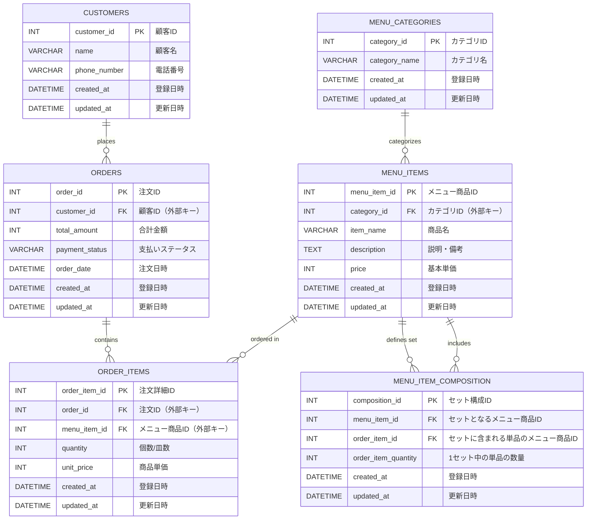

## 課題2

### 課題2-1

シャリの有無について

1. わさび抜きのようにカラムを追加する

【メリット】
- 早い

【デメリット】
- 拡張性がない
  - 他のオプションが増えていくたびに、order_detailsにカラムを追加する必要がある

2. オプションテーブルのようなものを作成する

【メリット】
- 拡張性と保守性が上がる

【デメリット】
- 手間がかかる

### 課題2-2

menu_item_compositionを作成
「どのセット商品に、どの単品が、何個含まれるか」を表すテーブルです。

| フィールド           | 型        | 説明                                                   |
|----------------------|----------|---------------------------------------------------------|
| composition_id       | INT (PK) | 連番（セット構成テーブルを一意に識別するID）            |
| menu_item_id         | INT (FK) | “セット”となるメニュー商品のID                          |
| item_id              | INT (FK) | “セットに含まれる単品”のメニュー商品ID                  |
| item_quantity        | INT      | 1セット中に含まれる単品ネタの数量                       |
| created_at           | DATETIME | 登録日時                                                |
| updated_at           | DATETIME | 更新日時                                                |

### 課題2-3

クーポンなどの割引があった場合
