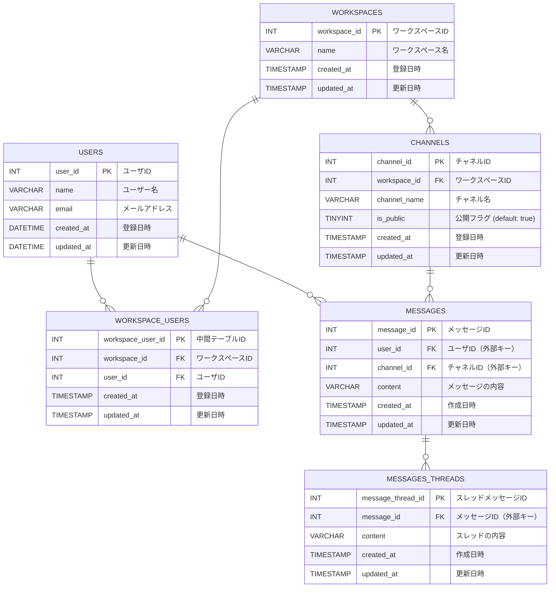

## 必要なテーブル

- メッセージ
- スレッドメッセージ
- チャネル
- ユーザ
- 横断機能

### メッセージ (messages)

| キー | カラム名   | データ型  | 制約     | 説明                         |
| ---- | ---------- | --------- | -------- | ---------------------------- |
| PK   | message_id | INT       | NOT NULL |                              |
| FK   | user_id    | INT       | NOT NULL | ユーザーテーブルとの紐付け   |
| FK   | channel_id | INT       | NOT NULL | チャンネルテーブルとの紐付け |
|      | content    | VARCHAR   | NOT NULL | メッセージの内容             |
|      | created_at | TIMESTAMP | NOT NULL |                              |
|      | updated_at | TIMESTAMP | NOT NULL |                              |

### スレッドメッセージ (messages_threads)

| キー | カラム名          | データ型  | 制約     | 説明                         |
| ---- | ----------------- | --------- | -------- | ---------------------------- |
| PK   | message_thread_id | INT       | NOT NULL |                              |
| FK   | message_id        | INT       | NOT NULL | メッセージテーブルとの紐付け |
|      | content           | VARCHAR   | NOT NULL | スレッドの内容               |
|      | created_at        | TIMESTAMP | NOT NULL |                              |
|      | updated_at        | TIMESTAMP | NOT NULL |                              |

### チャネル (channels)

| キー | カラム名     | データ型  | 制約                   | 説明                          |
| ---- | ------------ | --------- | ---------------------- | ----------------------------- |
| PK   | channel_id   | INT       | NOT NULL               |                               |
|      | channel_name | VARCHAR   | NOT NULL               | channenl名                    |
|      | is_public    | TINY INT  | NOT NULL, default true | チャンネルがpublicかprivateか |
|      | created_at   | TIMESTAMP | NOT NULL               |                               |
|      | updated_at   | TIMESTAMP | NOT NULL               |                               |

### ユーザ (users)

| キー | カラム名   | データ型  | 制約     | 説明           |
| ---- | ---------- | --------- | -------- | -------------- |
| PK   | user_id    | INT       | NOT NULL |                |
|      | name       | VARCHAR   | NOT NULL | ユーザー名     |
|      | email      | VARCHAR   | NOT NULL | メールアドレス |
|      | created_at | DATETTIME | NOT NULL |                |
|      | updated_at | DATETTIME | NOT NULL |                |

### ワークスペース(workspace)

| キー | カラム名     | データ型  | 制約     | 説明                 |
| ---- | ------------ | --------- | -------- | -------------------- |
| PK   | workspace_id | INT       | NOT NULL |                      |
| FK   | user_id      | INT       | NOT NULL |                      |
|      | name         | VARCHAR   | NOT NULL | ワークスペースの名前 |
|      | created_at   | DATETTIME | NOT NULL |                      |
|      | updated_at   | DATETTIME | NOT NULL |                      |

### ワークスペースユーザー (workspace_users)

| キー | カラム名          | データ型  | 制約     | 説明                             |
| ---- | ----------------- | --------- | -------- | -------------------------------- |
| PK   | workspace_user_id | INT       | NOT NULL | 中間テーブルのID                 |
| FK   | workspace_id      | INT       | NOT NULL | ワークスペーステーブルとの紐付け |
| FK   | user_id           | INT       | NOT NULL | ユーザーテーブルとの紐付け       |
|      | created_at        | TIMESTAMP | NOT NULL | 登録日時                         |
|      | updated_at        | TIMESTAMP | NOT NULL | 更新日時                         |




### 横断機能 (searches)

DMLで実装する

:current_user_id => 検索したuserのid
:search_keyword => 検索したいキーワード

```:sql
SLECT m.*
FROM messages m
JOIN channels c
  ON c.channel_id = m.channel_id
  AND c.user_id = :current_user_id
WHERE m.content ILIKE '%' || :search_keyword || '%'
```
