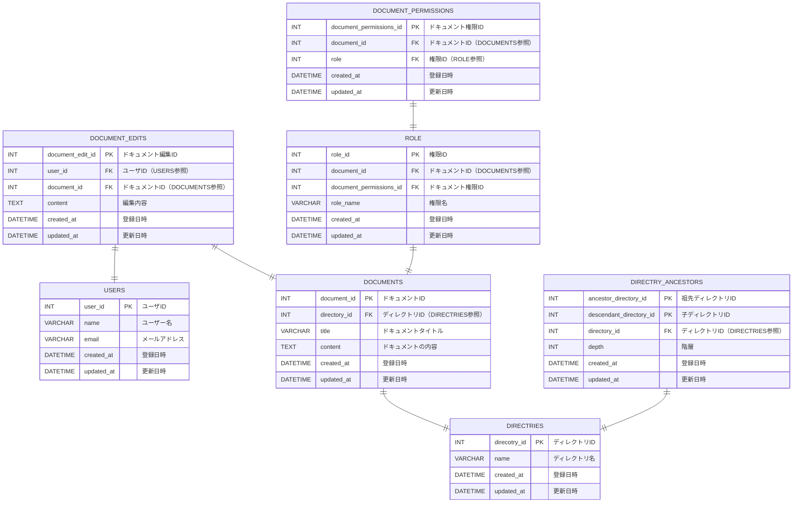

## Confluenceのようなドキュメント管理システム

【核となるイベント】
ドキュメントの管理するシステムなので、**ドキュメントのCRUD**をすることが、核となるイベント
核となるテーブルはdocument

【リソースの抜き出し】
- **documents**
  - 今回のキーテーブル
- **document_edits**
  - documentsを編集、書き込みする際に複数の人が書き込むので中間テーブルを置く
  - SQLアンチパターン第1章を参照
    - https://zenn.dev/empenguin/articles/dc7dbd4af10847
- **roles**
  - 編集の権限を管理するテーブル
  - 本来document_editsテーブルでカラムとして定義してもよかったが、enumを使用する場合にはすでに決まったstatusがある場合のみ使ってもいいとSQLアンチパターンで書いていたのでテーブルを分割した。
  - https://qiita.com/yk0807/items/90065858733709938d0b
- **document_permissions**
  - Documentとroleの中間テーブル
  - 編集権限があるかなどを判別するテーブル
- **users**
  - ユーザーテーブル
- **direcotries**
  - 階層構造の仕様を満たすためのテーブル
- **directory_ancestors**
  - 階層構造の仕様を満たすためのテーブル
  - 祖先と子のidを持つ
  - https://techblog.asia-quest.jp/202409/design-patterns-for-hierarchical-structures
  - SQLアンチパターン第2章参照

## テーブル

**users**

| キー | カラム名   | データ型  | 制約     | 説明                     |
| ---- | ---------- | --------- | -------- | ------------------------ |
| PK   | user_id    | INT       | NOT NULL |                          |
|      | name       | VARCHAR   | NOT NULL | ユーザー名               |
|      | email      | VARCHAR   | NOT NULL | メールアドレス           |
|      | created_at | DATETTIME | NOT NULL |                          |
|      | updated_at | DATETTIME | NOT NULL |                          |

**documents**

| キー | カラム名     | データ型  | 制約     | 説明                        |
| ---- | ------------ | --------- | -------- | --------------------------- |
| PK   | document_id  | INT       | NOT NULL |                             |
| FK   | directory_id | INT       | NOT NULL | directoryテーブルと紐付ける |
|      | title        | VARCHAR   | NOT NULL | ドキュメントのtitle         |
|      | content      | TEXT      | NOT NULL | ドキュメントの内容          |
|      | created_at   | DATETTIME | NOT NULL |                             |
|      | updated_at   | DATETTIME | NOT NULL |                             |

**document_edits**

| キー | カラム名         | データ型  | 制約     | 説明 |
| ---- | ---------------- | --------- | -------- | ---- |
| PK   | document_edit_id | INT       | NOT NULL |      |
| FK   | user_id          | INT       | NOT NULL |      |
| FK   | document_id       | INT       | NOT NULL |      |
|      | content          | TEXT      | NOT NULL |      |
|      | created_at       | DATETTIME | NOT NULL |      |
|      | updated_at       | DATETTIME | NOT NULL |      |

**role**

| キー | カラム名   | データ型  | 制約     | 説明   |
| ---- | ---------- | --------- | -------- | ------ |
| PK   | role_id    | INT       | NOT NULL |        |
| FK   | document_id | INT       | NOT NULL |        |
|      | role_name  | VARCHAR   | NOT NULL | 権限名 |
|      | created_at | DATETTIME | NOT NULL |        |
|      | updated_at | DATETTIME | NOT NULL |        |

**directries**

| キー | カラム名                | データ型  | 制約     | 説明           |
| ---- | ----------------------- | --------- | -------- | -------------- |
| PK   | direcotry_id            | INT       | NOT NULL |                |
|      | name                    | VARCHAR   | NOT NULL | ディレクトリ名 |
|      | created_at              | DATETTIME | NOT NULL |                |
|      | updated_at              | DATETTIME | NOT NULL |                |

**directry_ancestors**

| キー | カラム名                | データ型  | 制約     | 説明               |
| ---- | ----------------------- | --------- | -------- | ------------------ |
| PK   | ancestor_directory_id   | INT       | NOT NULL |                    |
| PK   | descendant_directory_id | INT       | NOT NULL |                    |
| FK   | directory_id            | INT       | NOT NULL |                    |
|      | depth                   | INT       | NOT NULL | ディレクトリの階層 |
|      | created_at              | DATETTIME | NOT NULL |                    |
|      | updated_at              | DATETTIME | NOT NULL |                    |

**document_permissions**

| キー | カラム名                | データ型  | 制約     | 説明               |
| ---- | ----------------------- | --------- | -------- | ------------------ |
| PK   | document_permissions_id | INT       | NOT NULL |                    |
| FK   | document_id             | INT       | NOT NULL |                    |
| FK   | role                    | INT       | NOT NULL | ディレクトリの階層 |
|      | created_at              | DATETTIME | NOT NULL |                    |
|      | updated_at              | DATETTIME | NOT NULL |                    |

### 工夫した点

1. 権限周りと編集テーブルを多対多の構成にすることで、SQLアンチパターン1章のジェイウォークを回避した
2. 階層構造の設計でclosureテーブルを用いておこなった。このようにすることで、CRUD操作をしやすいようにおこなった
   1. https://zenn.dev/convers39/articles/b5802c05d62dc5

