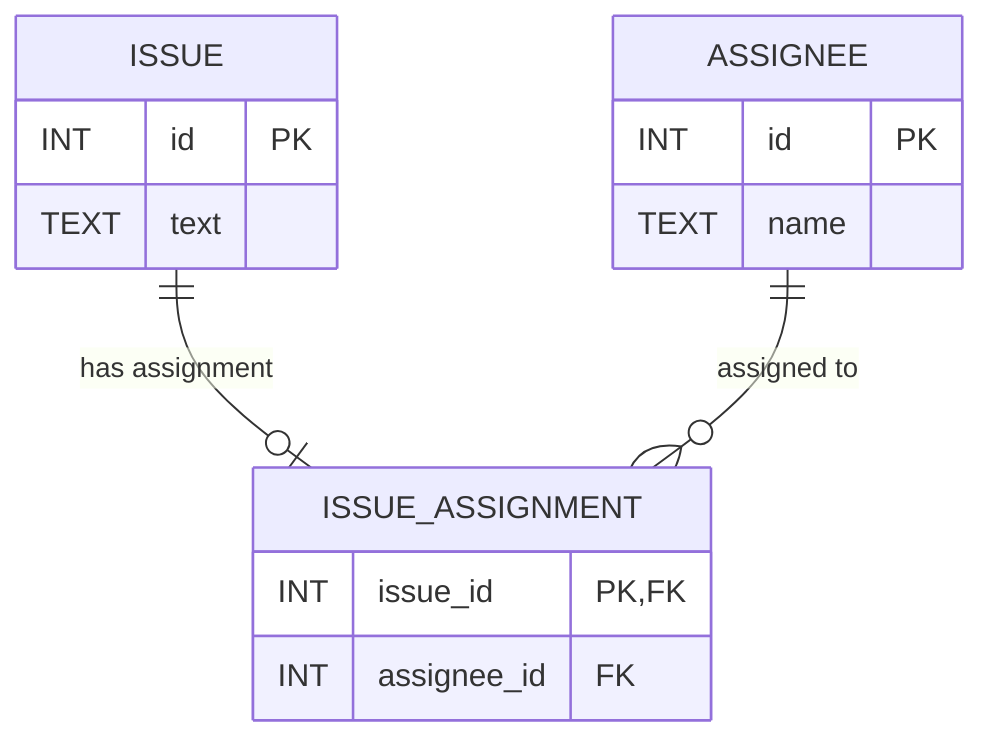

### 解決法

- 新たにissue_assignmentとう中間テーブルを作成する

【作成することで何が変わるか】
- issueテーブルからassigned_to_idカラムを削除できる
- 中間テーブルを置くことで、未アサインの場合は、レコードがない。逆にアサインがある時はレコードがあるというふうにできる。

### NULLを使う場合のメリット・デメリット

【メリット】

- 制約をしていない分、データの入力時に柔軟性を持てる
正直他は思いつかない....

【デメリット】
- 3値論理を考慮せねばならない。
  - https://for.kobayashiii.dev/articles/r_booacwr2
- SQLのクエリを発行する際に、iS NOT NULLなどを入れるとインデックスが参照されないのでパフォーマンスが悪い
- NULL の伝播
  - https://for.kobayashiii.dev/articles/r_booacwr2
