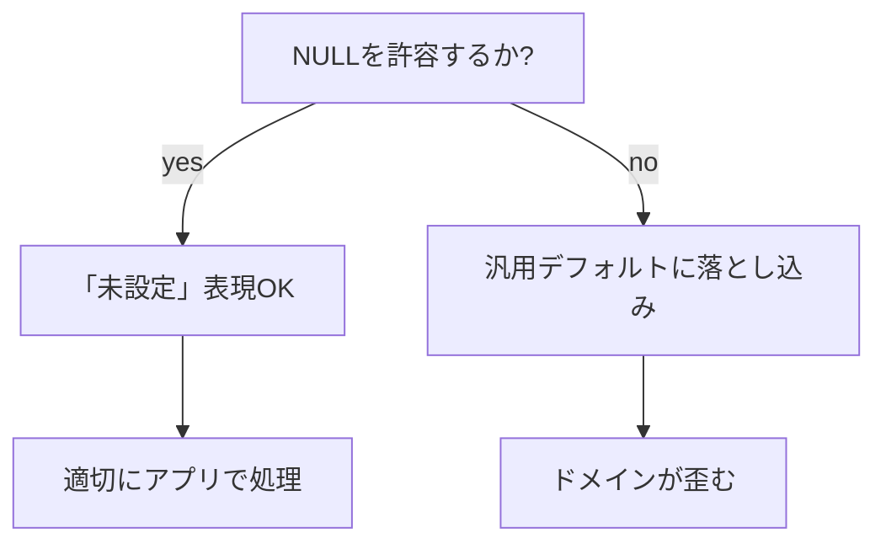

### なんでもかんでもNOT NULLにするべきでない理由

- 業務ロジックが不整合を起こす

BOOLANの場合
そのフラグが立っていないことと、値がわからないことを同じFALSEにしてしまう。

TEXTの場合
空文字でまだ入力されていないケースと本当に空文字の場合で区別がつかない

- NULLとdefault値を混同する

三値論理のメリットの消失
NULL -> UNKNOWEN -> WHEREで弾くといった制御ができなくなる

