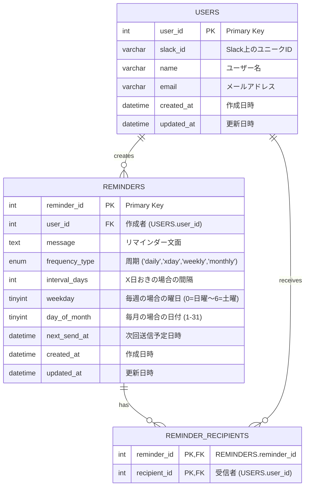

## 【核となるイベント】

## 【リソースの抜き出し】

- users
  - Slackに登録しているユーザー情報
- reminders
  - 各リマインダーの基本設定を管理するテーブル
- reminder_recipients
  - 1 つのリマインダーが複数の受信者（Slack ユーザー）に配信されるための、多対多の関係を管理する中間テーブルです。

```mermaid
erDiagram
    USERS {
      int user_id PK "Primary Key"
      varchar slack_id "Slack上のユニークID"
      varchar name "ユーザー名"
      varchar email "メールアドレス"
      datetime created_at "作成日時"
      datetime updated_at "更新日時"
    }
    
    REMINDERS {
      int reminder_id PK "Primary Key"
      int user_id FK "作成者 (USERS.user_id)"
      text message "リマインダー文面"
      enum frequency_type "周期 ('daily','xday','weekly','monthly')"
      int interval_days "X日おきの場合の間隔"
      tinyint weekday "毎週の場合の曜日 (0=日曜～6=土曜)"
      tinyint day_of_month "毎月の場合の日付 (1-31)"
      datetime next_send_at "次回送信予定日時"
      datetime created_at "作成日時"
      datetime updated_at "更新日時"
    }
    
    REMINDER_RECIPIENTS {
      int reminder_id PK, FK "REMINDERS.reminder_id"
      int recipient_id PK, FK "受信者 (USERS.user_id)"
    }
    
    USERS ||--o{ REMINDERS : "creates"
    REMINDERS ||--o{ REMINDER_RECIPIENTS : "has"
    USERS ||--o{ REMINDER_RECIPIENTS : "receives"
```
