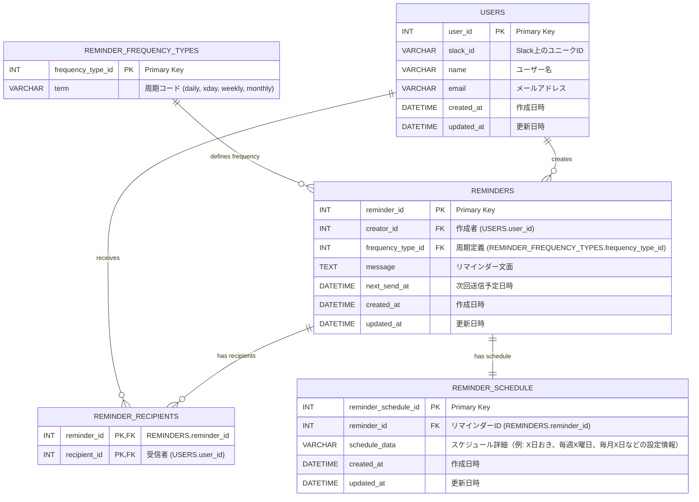

## 【核となるイベント】

## 【リソースの抜き出し】

- users
  - Slackに登録しているユーザー情報
- reminders
  - 各リマインダーの基本設定を管理するテーブル
- reminder_recipients
  - 1 つのリマインダーが複数の受信者（Slack ユーザー）に配信されるための、多対多の関係を管理する中間テーブルです。
- reminder_frequency_types
  - 周期の種類（daily, xday, weekly, monthly など）を管理するテーブルです。
  - SQLアンチパターン10章を参考にして、テーブルを分割しました
- reminder_daily
  - 毎日の場合のテーブル
- reminder_frequency_xday
  - x日おきの間隔のテーブル
- reminder_frequency_weekly
  - 週間隔のテーブル
- reminder_frequency_monthly
  - 月間隔のテーブル

### users

| キー | カラム名   | データ型  | 制約     | 説明           |
| ---- | ---------- | --------- | -------- | -------------- |
| PK   | user_id    | int       | NOT NULL |                |
|      | slack_id   | VARCHAR   | NOT NULL |                |
|      | name       | VARCHAR   | NOT NULL | ユーザー名     |
|      | email      | VARCHAR   | NOT NULL | メールアドレス |
|      | created_at | DATETTIME | NOT NULL |                |
|      | updated_at | DATETTIME | NOT NULL |                |

### reminders

| キー | カラム名          | データ型  | 制約     | 説明           |
| ---- | ----------------- | --------- | -------- | -------------- |
| PK   | reminder_id       | int       | NOT NULL |                |
| FK   | user_id           | int       | NOT NULL |                |
|      | message           | text      | NOT NULL | 送るメッセージ |
|      | frequency_type_id | int       | NOT NULL |                |
|      | next_send_at      | DATETIME  | NOT NULL |                |
|      | created_at        | DATETTIME | NOT NULL |                |
|      | updated_at        | DATETTIME | NOT NULL |                |

### reminder_frequency_types

| キー | カラム名          | データ型 | 制約             | 説明                                      |
| ---- | ----------------- | -------- | ---------------- | ----------------------------------------- |
| PK   | frequency_type_id | INT      | NOT NULL         |                                           |
|      | term              | VARCHAR  | NOT NULL, UNIQUE | 周期コード (daily, xday, weekly, monthly) |

### reminder_schedule

| キー | カラム名             | データ型 | 制約     | 説明               |
| ---- | -------------------- | -------- | -------- | ------------------ |
| PK   | reminder_schedule_id | INT      | NOT NULL |                    |
| FK   | frequency_type_id    | INT      | NOT NULL |                    |
|      | data                 | VARCHAR  | NOT NULL | スケジュールの情報 |

