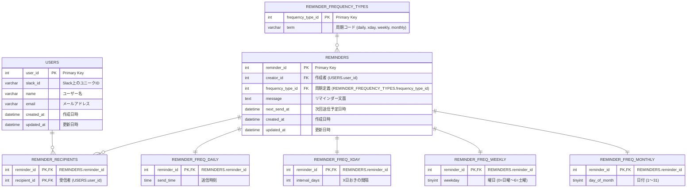

## 【核となるイベント】

## 【リソースの抜き出し】

- users
  - Slackに登録しているユーザー情報
- reminders
  - 各リマインダーの基本設定を管理するテーブル
- reminder_recipients
  - 1 つのリマインダーが複数の受信者（Slack ユーザー）に配信されるための、多対多の関係を管理する中間テーブルです。
- reminder_frequency_types
  - 周期の種類（daily, xday, weekly, monthly など）を管理するテーブルです。
  - SQLアンチパターン10章を参考にして、テーブルを分割しました
- reminder_daily
  - 毎日の場合のテーブル
- reminder_frequency_xday
  - x日おきの間隔のテーブル
- reminder_frequency_weekly
  - 週間隔のテーブル
- reminder_frequency_monthly
  - 月間隔のテーブル

### users

| キー | カラム名   | データ型  | 制約     | 説明           |
| ---- | ---------- | --------- | -------- | -------------- |
| PK   | user_id    | int       | NOT NULL |                |
|      | slack_id   | VARCHAR   | NOT NULL |                |
|      | name       | VARCHAR   | NOT NULL | ユーザー名     |
|      | email      | VARCHAR   | NOT NULL | メールアドレス |
|      | created_at | DATETTIME | NOT NULL |                |
|      | updated_at | DATETTIME | NOT NULL |                |

### reminders

| キー | カラム名          | データ型  | 制約     | 説明           |
| ---- | ----------------- | --------- | -------- | -------------- |
| PK   | reminder_id       | int       | NOT NULL |                |
| FK   | user_id           | int       | NOT NULL |                |
|      | message           | text      | NOT NULL | 送るメッセージ |
|      | frequency_type_id | int       | NOT NULL |                |
|      | next_send_at      | DATETIME  | NOT NULL |                |
|      | created_at        | DATETTIME | NOT NULL |                |
|      | updated_at        | DATETTIME | NOT NULL |                |

### reminder_frequency_daily

| キー | カラム名    | データ型 | 制約     | 説明     |
| ---- | ----------- | -------- | -------- | -------- |
| PK   | reminder_id | INT      | NOT NULL |          |
|      | send_time   | DATETIME | NOT NULL | 送信時刻 |

### reminder_frequency_xday

| キー | カラム名      | データ型 | 制約     | 説明          |
| ---- | ------------- | -------- | -------- | ------------- |
| PK   | reminder_id   | int      | NOT NULL |               |
|      | interval_days | INT      | NOT NULL | X日おきの間隔 |

### reminder_frequency_weekly

| キー | カラム名    | データ型 | 制約     | 説明                  |
| ---- | ----------- | -------- | -------- | --------------------- |
| PK   | reminder_id | INT      | NOT NULL |                       |
|      | weekday     | TINYINT  | NOT NULL | 曜日 (0=日曜〜6=土曜) |

### reminder_frequency_monthly

| キー | カラム名     | データ型 | 制約     | 説明         |
| ---- | ------------ | -------- | -------- | ------------ |
| PK   | reminder_id  | INT      | NOT NULL |              |
|      | day_of_month | TINYINT  | NOT NULL | 日付 (1～31) |

### reminder_recipients

| キー  | カラム名     | データ型 | 制約     | 説明                 |
| ----- | ------------ | -------- | -------- | -------------------- |
| PK,FK | reminder_id  | INT      | NOT NULL |                      |
| PK,FK | recipient_id | INT      | NOT NULL | 受信者 USERS.user_id |

### reminder_frequency_types

| キー | カラム名          | データ型 | 制約             | 説明                                      |
| ---- | ----------------- | -------- | ---------------- | ----------------------------------------- |
| PK   | frequency_type_id | INT      | NOT NULL         |                                           |
|      | term              | VARCHAR  | NOT NULL, UNIQUE | 周期コード (daily, xday, weekly, monthly) |

