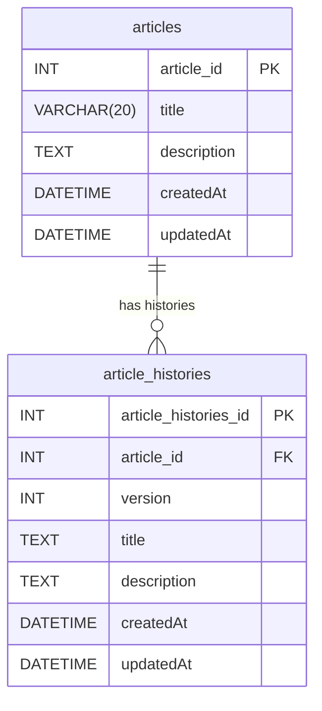

### リソースの抜き出し

- 記事
- 記事の履歴

### テーブル

- **articles**
  - 記事のテーブル
  - このアプリの肝となるテーブル

- **article_histories**
  - 記事の履歴テーブル
  - 全ての履歴をみれるように、versionカラムを用意する
  - https://qiita.com/ak-ymst/items/2e8e92f212c807bb09a1

### テーブル設計

**articles**

| キー | カラム名    | データ型    | 制約     | 説明   |
| ---- | ----------- | ----------- | -------- | ------ |
| PK   | article_id  | int         | NOT NULL | 主キー |
|      | title       | VARCHAR(20) | NOT NULL |        |
|      | description | text        | NOT NULL |        |
|      | created_at  | DATETTIME   | NOT NULL |        |
|      | updated_at  | DATETTIME   | NOT NULL |        |

**article_histories**

| キー | カラム名             | データ型    | 制約     | 説明              |
| ---- | -------------------- | ----------- | -------- | ----------------- |
| PK   | aritcle_id           | int         | NOT NULL | 主キー            |
| FK   | aritcle_histories_id | int         | NOT NULL | articleの外部キー |
|      | title                | VARCHAR(20) | NOT NULL |                   |
|      | description          | text        | NOT NULL |                   |
|      | version              | INT         | NOT NULL | incrementする     |
|      | created_at           | DATETTIME   | NOT NULL |                   |
|      | updated_at           | DATETTIME   | NOT NULL |                   |

## ER図

