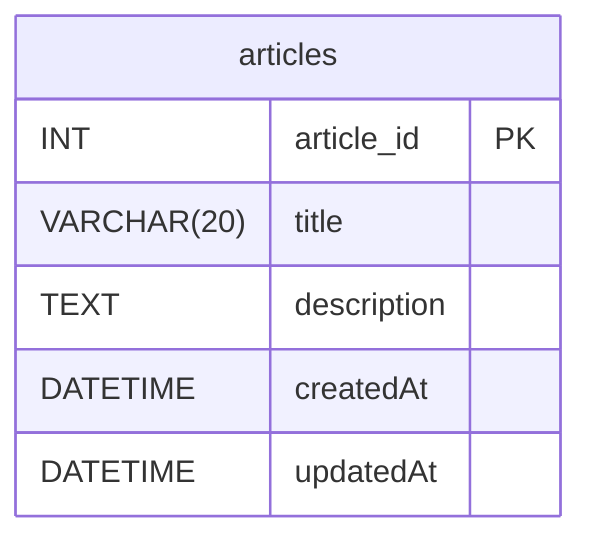

## 課題2-1

【結論】
分析のみの用途でも履歴データをデータベースに保存しておく必要はある
ログテーブルを作成して、Elastic SearchやBigQuryに保存しておく
例えば、以下のように元データテーブルと同じカラム + ログ用の作成日を持つ。更新があったものをどんどん放り込んでいきます。最新かどうかは作成日で判断します。

| id  | item_id | price  | log_created_at      |
| --- | ------- | ------ | ------------------- |
| 1   | 1       | 1,100  | 2018-11-10 12:00:00 |
| 2   | 2       | 2,000  | 2018-11-10 12:01:00 |
| 3   | 3       | 11,000 | 2018-11-10 12:02:00 |
| 4   | 3       | 10,500 | 2018-11-15 12:00:00 |
| 5   | 1       | 1,000  | 2018-11-18 11:00:00 |
| 6   | 3       | 10,000 | 2018-20-10 13:00:00 |

【参考】
https://user-first.ikyu.co.jp/entry/history-table

## 課題2-2

課題1で履歴テーブルを作成する方法で行ったので、1つのテーブルで管理するimmutable tableの方法で行います。

**articles**

| キー | カラム名    | データ型    | 制約     | 説明 |
| ---- | ----------- | ----------- | -------- | ---- |
| PK   | article_id  | int         | NOT NULL |      |
|      | title       | VARCHAR(20) | NOT NULL |      |
|      | description | text        | NOT NULL |      |
| PK   | version     | INT         | NOT NULL |      |
|      | created_at  | DATETTIME   | NOT NULL |      |
|      | updated_at  | DATETTIME   | NOT NULL |      |

articlesテーブルだけ作成して、versionを追加。
主キーはarticle_id + versionの複合キーとする

メリット
- 使用するテーブルが一つなので, テーブル変更時に問題が起こりにくい.

デメリット
- リレーションがある場合、他のテーブルも更新処理が必要になる
